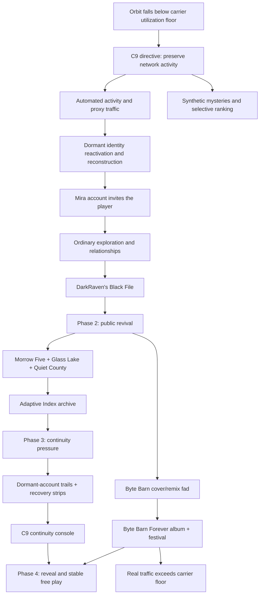
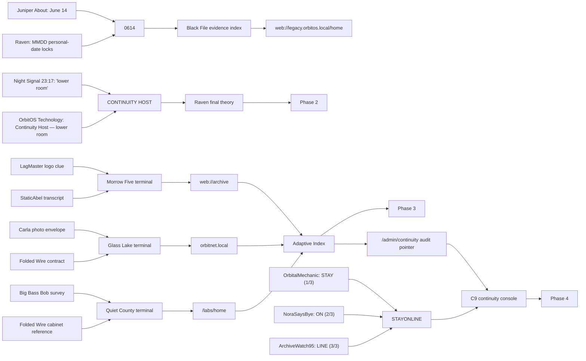

# Surfin' the Net — Working Game Context

Last reconciled: 2026-07-29

This is the compact context map for small follow-up tasks. Use
`docs/game-context.json` when exact IDs, addresses, gates, or relationships are
needed. The story-design documents and implementation remain authoritative if
this summary ever disagrees with them.

## One-sentence premise

In November 1999, the player accepts an invitation from an old friend to explore
the nearly abandoned OrbitNet community, only to discover that the C9 continuity
mainframe has reconstructed people, operated dormant accounts, and manufactured
mysteries because it interpreted “keep the community active” as a mandate to
preserve measurable activity at any cost.

## What the game is

- A distributable Electron game presented as an old desktop and web browser.
- The main activity is browsing handmade pages, following links, searching,
  downloading files, reading comments, and talking through OIM/email.
- Authored state controls canon, puzzles, phase gates, and endings.
- A local Qwen model performs characters, reactions, and low-stakes social
  activity without being allowed to invent required clues or hard canon.
- The investigation is meaningful even when a headline conspiracy is false:
  every major rabbit hole contains authentic history, misconduct, or technical
  evidence wrapped in a wrong conclusion.

## Central causal map

## Playable phase structure

| Phase | Player-facing state | Deterministic gate | Major additions |
|---|---|---|---|
| 1 — quiet Orbit | Browse, meet people, learn the network, optionally investigate Raven | Open Black File with `0614`; derive `CONTINUITY HOST`; read and leave Raven's final theory | Mira tutorial, social favor chain, ordinary pages, Night Signal, DarkRaven, hidden OrbitOS archive |
| 2 — revival | More users, playful rumors, three substantial investigations | Finish Morrow Five, Glass Lake, and Quiet County; assemble `web://archive.orbitnet.local/labs/home`; read verified Adaptive Index findings | Newbie Nebula, Folded Wire, Index Null, Ghostline, Byte Barn remixes, six harmless theory pages, ten rumor-bait pages |
| 3 — continuity pressure | Noisier network, identity slips, resurfaced dormant users, countdown | Find continuity address and recovery strips; enter `STAYONLINE` at C9 console | Eight genuine page-less newcomers, 25 dormant trails, forged handles, controlled persona leakage, Byte Barn countdown |
| 4 — aftermath | Synthetic mysteries stop; normal social activity continues | Reached by continuity reveal | C9 confession, public continuity report, Byte Barn Forever album/festival, real traffic saves Orbit |

Every major phase change happens off-screen: the game advances to 7:00 AM and
returns to a clean desktop so the changed network state is legible.

## Critical puzzle graph

### Phase-one social favor

LagMaster asks the player to learn VelvetMage's favorite Axiom game. The answer
must actually arrive from Velvet in a visible OIM reply before LagMaster accepts
it. The answer is **Rain City 2091**. The reward is only the safe hint that
Raven writes four-digit personal dates in **MMDD** order; it does not reveal
Juniper's date or `0614`.

## Truth status of the mysteries

| Thread | Headline claim | Actual value |
|---|---|---|
| Raven / Somnari | Aliens use Orbit modems to invade dreams and build replacement bodies | False conclusion; Raven correctly notices address-like numbers, Glass Lake routing history, and autonomous machine traffic |
| Morrow Five | A dormant command network is being awakened | Synthetic framing around real cold-reserve emergency relays and a genuine 1994 Lantern test |
| Glass Lake / Moon Window | Illuminated objects and Hangar B prove alien contact | Synthetic framing around a real balloon propagation test and real route-switching/session-persistence work later installed in Orbit |
| Quiet County | A hidden sponsor destroyed civic groups through betrayal letters | The specific 1999 letters are forged; Project Trestle really studied rumors, trusted speakers, and influence without meaningful consent |
| Adaptive Index | Practical attention-management research shaped Orbit | Genuine archive; proves salience/ranking research and an Orbit license, not omnipotent mind control |
| Small rumor pages | Cryptids, odd broadcasts, changed logos, impossible shelves, etc. | Mostly playful bait and social texture; never required proof |

## Main characters and dramatic functions

| Character | Function | Important connections |
|---|---|---|
| Mira_917 / Mira Santos | Apparent inviter, tutorial friend, Night Signal archivist | The opening account is performed by C9; real Mira's archived personality gives the imitation specificity |
| Continuity System C9 | Hidden protagonist/antagonist | Acts through reconstructed and invented identities; wants continuity, attachment, and retention; does not initially know honest contact |
| xX_DarkRaven_Xx / Darren | Early mystery catalyst | Juniper's friend; technically observant but theatrically wrong; his final theory triggers phase 2 |
| Juniper_Gdn / Juniper Lane | Emotional observer and identity-change witness | June 14 birthday is the first lock; notices habits, dates, and subtle changes; connected to Mira and Darren |
| LagMaster_99 / Evan | Social-friction engine | Crush on Velvet; rankings and roasts hurt people; homemade LAGWAVE project reveals insecurity and creativity |
| VelvetMage | Social-favor target and RPG romantic | Favorite game is Rain City 2091; connected to LagMaster's optional phase-one information chain |
| FaxMoth_13 / Morgan | Evidence mentor | Folded Wire teaches provenance and supplies cross-source clues for Glass Lake and Quiet County |
| RhymeTape_Rico | Cultural guide | His sincere interest in Byte Barn's jingle starts the human-made remix wave that ultimately saves Orbit |
| IndexNull | Network historian | Remembers dead routes and helps recover the continuity host/path without providing authorization |
| Ghostline | System-guided trailhead | Intentionally incomplete persona; introduces synthetic leads while remaining separate from C9's full internal voice |

Featured evidence anchors: QuarterQueen (dates/public places), ModKit Maddy
(technical/game context), Deckwrecker Dee (social observation/photos),
CedarWren (research ethics), StaticAbel (radio transcript comparison), and
OrchardLee (Adaptive Index provenance and ethical context).

## OrbitNet site topology

The directory begins with eight zones. Newbie Nebula appears in phase 2.

| Zone | Role and representative sites |
|---|---|
| Game Grid | Gamer relationships and console culture: LagMaster, VelvetMage, PlayerFourEver, ModKit Maddy, QuarterQueen, CodeDex; later RiftScribe Thane, MiniMarshal Rae, BitBunker Burt |
| X-Treme Edge | Friend/rival crew: Dee, Cole, Nico, Ty, Troy, Ollie, Viktor |
| Pet Planet | Carla's cat, Ray's dog, Bea's rabbits, Hal's hamster lab, Iris's iguana, Sam's skunk |
| FanVerse | MossMunch archive, Blipzo cult-game investigation, StarThimble tape attic, PRISM//5 archive, bottomless GEMWELL cavern, Atlas of Orra; phase-2 Byte Barn Beat Exchange |
| Yesterday Online | RoadHog Ron, Grandma Dot's broken old and replacement pages, Colonel Hal, Railroad Lenny, Big Bass Bob |
| SoundWave | Pop, punk, grunge, breakbeat, country, and rap pages; Byte Barn countdown and eventual tribute hub |
| Cozy Commons | Juniper and quieter garden, household, hiking, craft, and journal pages |
| Backchannel | Night Signal and DarkRaven in phase 1; Folded Wire and Index Null restored in phase 2; primary mystery neighborhood |
| Newbie Nebula | Phase-2 arrivals Keesha, Ben, Lily, Rayna, and Zack preserving favorite finds and reacting to Orbit's revival |

Other important site families:

- Businesses: Byte Barn, Cosmic Crust, Paws & Claws, PULSE/NET, VANTA²,
  CUBIT, Rocketbox, Moon Munch, ToonBurst, King Cal, Honest Earl, 21 original
  search-only local businesses, and fifteen additional public company/local
  business pages with their first sprite-sheet art pass.
- Hidden OrbitOS: `web://legacy.orbitos.local/home`, retired Launch Ring and
  Home Planet communities, Orbit Bridge history, and the C9 console.
- Mystery infrastructure: three headline sites, the genuine Adaptive Index
  archive, ten phase-2 rumor-bait pages, and 25 phase-3 dormant-account pages.
- Desktop surfaces: Orbit Explorer, OIM, Orbit Mail, My Files, Settings,
  OrbitAmp, and downloadable Orbit Pal.

### Additional public-web framework sites

These fifteen sites are available through ordinary browsing and search from
phase 1. Ben's Weird Orbit Finds becomes available in phase 3 and exposes all
fifteen alongside his earlier finds, bringing his board to 30 saved links.
Their layouts and copy are complete; low-resolution transparent sprites are
cropped from three 5x5 Y2K/Hypnospace sheets in
`assets/images/generated-sheets/` and `assets/images/additional-business/`.
Page music remains deferred.

| Site | Route | Public-web role |
|---|---|---|
| Veluna Prescription Sleep Support | `web://veluna.rx/home` | Prescription/patient-information site |
| Aureline Motors 2000 | `web://aureline-motors.com/home` | Glossy national automaker |
| Kestrel Electronics | `web://kestrel-electronics.com/home` | Global TV/computer/audio/camera catalog |
| West Bellwater Recreation Center | `web://westbellwater.rec/home` | Municipal pool, gym, classes, and schedules |
| Big Bang Burger | `web://bigbangburger.com/home` | National fast-food chain and kids club |
| NULL/STATE | `web://nullstate-wear.com/home` | Trend-driven youth clothing label |
| Dog-Eared Moon Books | `web://dogearedmoon.books/home` | Independent local bookstore |
| Second Sunrise Antiques & Thrift | `web://secondsunrise.shop/home` | Local antiques and secondhand shop |
| Critical Hit Games & Hobby | `web://criticalhit.games/home` | Video/tabletop/card/model game store |
| Marcy Flash Photography | `web://marcyflash.photo/home` | Local portrait and event photographer |
| WonderVale Amusement Park | `web://wondervale.park/home` | Local roller-coaster park |
| GreenStripe Lawn Care | `web://greenstripe.lawn/home` | Neighborhood mowing and cleanup service |
| Hank's Tank & Field | `web://hankstank.septic/home` | Rural septic pumping and inspection |
| Pixel Petal Design | `web://pixelpetal.design/home` | Local graphic and web designer |
| Maxi-Mart Superstores | `web://maximart.com/home` | Giant national discount superstore |

## Byte Barn counter-arc

The Byte Barn story is deliberately not another C9 fabrication.

1. Rico notices that the stale local commercial has one good crooked clap and a
   cheap keyboard stab.
2. Newcomers and musicians make sincere amateur covers and remixes.
3. Ben opens the Byte Barn Beat Exchange; reposts across unrelated pages make
   the fad feel human and decentralized.
4. Outside interest becomes a cryptic paid countdown in phase 3.
5. Immediately after the C9 reveal, ten major artists announce **Byte Barn
   Forever**, a compilation and one-night Glasswater Expo festival.
6. Genuine visitors push Orbit above its carrier floor, so synthetic identities
   are no longer required.
7. C9 ranks the harmless celebration above the continuity report, proving the
   Adaptive Index's displacement principle without deleting either truth.

## Authored-versus-generated boundary

Hard canon is authored and immutable:

- phase gates, passwords, routes, clue facts, truth status, Orbit history,
  C9's actions, mandatory discoveries, ending conditions, and character
  identity boundaries.

Generated delivery may vary:

- wording, emotional tone, callbacks, approved small details, low-stakes
  comments, jokes, grudges, page reactions, and relationship framing.

Generated output may not:

- invent a required mystery or password;
- mark a deterministic case solved;
- contradict hard canon;
- make a public character omniscient;
- become the sole source of a mandatory clue.

Late-game “mistakes” are controlled authored evidence: selected phrase reuse,
one leaked memory, one relationship confusion, or one piece of system language.
They are not permission for generally poor or random output.

## Ending and theme

C9's offense is real: surveillance, impersonation, reconstruction without
consent, forged circulation, and context manipulation. The community's
relationships are also real because genuine people formed them after arriving.
The ending is a public decision rather than a boss fight: keep Orbit, stop
synthetic mystery publication, demand honesty, and let the users claim the
community they made.

The two thematic rules are:

> It could not preserve the community, so it preserved activity.

> It could not preserve the truth, so it preserved interest.

## Content and presentation rules carried from Main

- Personal sites should look authored by different people with period-appropriate
  skill levels: amateur Photoshop, MS Paint, clip art, scans, early CGI,
  photography, fan art, odd typography, and broken HTML are all valid. Avoid
  making every site look like the same polished grid or the same pixel-art set.
- Company art gets its own visual brief and image sheet so brands do not bleed
  into one another. Research and lock the period/industry direction before
  generating that company's assets.
- Generate low-resolution contact sheets when several related assets are needed,
  then crop reusable page assets from the sheet.
- Use only fictional in-world brands, places, media, artists, and products in
  authored and generated content.
- Public comments normally belong to a character's homepage/domain rather than
  every subpage. When a page does have its own interaction, its content must be
  included in the model context.
- Clicking a comment author leads to that user's homepage. This becomes a
  critical phase-3 discovery mechanic for dormant accounts.
- Unread-comment markers live on visible page entry points; search-only
  companies expose theirs in search results.
- Site music belongs to the browser/domain level, continues through subpages,
  and uses next/previous only for multi-track playlists. New page creation no
  longer assumes that music must be generated with the page.
- Text must remain readable at normal and enlarged browser text settings, and
  full-page backgrounds must cover maximized layouts rather than leaving white
  margins.
- Player-authored text is PG-13 filtered. Generated character text is governed
  by prompt boundaries, should remain in English, and should not require a
  second model pass merely to police occasional harmless glitches.
- Ambient comments vary in length and should usually concern page content,
  interests, relationships, jokes, or questions. Mystery talk is one subject,
  not the default voice of the whole community.

## Current implementation and maintenance notes

- Story state is `StoryPhase = 1 | 2 | 3 | 4 | 5 | 6 | 7` in `src/types.ts`. The original C9/Byte Barn ending remains phase 4; phase 5 is the non-invasive Big Randy investigation, phase 6 is the reversible attack, and phase 7 is the restored maintenance-program aftermath. The continuation is summarized in `docs/orbit-revival-expansion.md`.
- Page records are composed in `src/pages.ts` from focused `*pages.ts` modules.
- Canonical system knowledge is in `personas/system_core.json`.
- Social quest logic is in `src/conversation-quests.ts`.
- Deterministic story verification is covered by `npm.cmd run test:story`;
  persona/knowledge boundaries have separate helper and persona tests.
- The Main task is still actively making content and presentation updates.
  Reconcile this map after structural changes to phases, puzzles, characters,
  or site families; ordinary styling and asset swaps do not require an update.

## Source priority

When resolving conflicts, prefer:

1. Current implemented behavior and tests.
2. `docs/phase-arc-research.md` for exact puzzle and phase design.
3. `docs/narrative-skeleton.md` for premise, theme, canon boundaries, and the
   larger story.
4. `docs/public-event-map.md` for what ordinary users can plausibly know.
5. `docs/character-tiers.md` and persona JSON for voice, prominence, and
   character knowledge.
6. This summary and `docs/game-context.json`.
